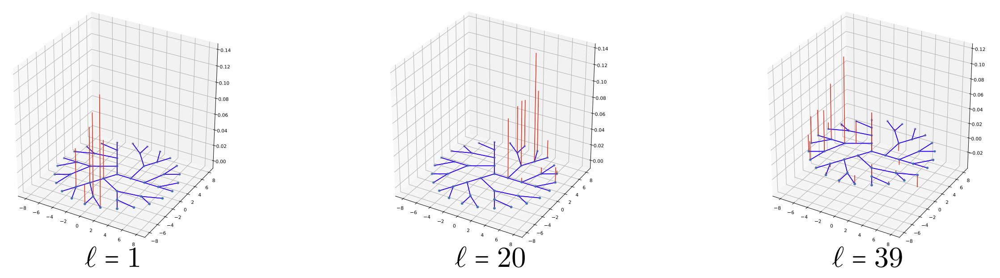

## Paper
* Multiresolution Matrix Factorization and Wavelet Networks on Graphs, Truong Son Hy, Risi Kondor Proceedings of Topological, Algebraic, and Geometric Learning Workshops 2022, PMLR 196:172-182, 2022. https://proceedings.mlr.press/v196/hy22a.html
* Learning Multiresolution Matrix Factorization and its Wavelet Networks on Graphs (longer version) https://arxiv.org/pdf/2111.01940.pdf.

## Authors
Truong Son Hy and Risi Kondor

## Requirement
* Python 3.7.10
* PyTorch 1.8.0

Recommend using Conda environment for easy installation.

## General organization
* ```data/```: Datasets.
* ```doc/```: Documentation in \LaTeX.
* ```experiments/```: Experiments of wavelet networks learning graphs (e.g., graph classification).
* ```source/```: Implementation of Multiresolution Matrix Factorization (MMF) including the original (baseline), learnable and sparse; and several examples.

Please check the pdf documentation in ```doc/``` for implementation details and usage.



## Cite our paper
```bibtex

@InProceedings{pmlr-v196-hy22a,
  title = 	 {Multiresolution Matrix Factorization and Wavelet Networks on Graphs},
  author =       {Hy, Truong Son and Kondor, Risi},
  booktitle = 	 {Proceedings of Topological, Algebraic, and Geometric Learning Workshops 2022},
  pages = 	 {172--182},
  year = 	 {2022},
  editor = 	 {Cloninger, Alexander and Doster, Timothy and Emerson, Tegan and Kaul, Manohar and Ktena, Ira and Kvinge, Henry and Miolane, Nina and Rieck, Bastian and Tymochko, Sarah and Wolf, Guy},
  volume = 	 {196},
  series = 	 {Proceedings of Machine Learning Research},
  month = 	 {25 Feb--22 Jul},
  publisher =    {PMLR},
  pdf = 	 {https://proceedings.mlr.press/v196/hy22a/hy22a.pdf},
  url = 	 {https://proceedings.mlr.press/v196/hy22a.html},
  abstract = 	 {Multiresolution Matrix Factorization (MMF) is unusual amongst fast matrix factorization algorithms in that it does not make a low rank assumption. This makes MMF especially well suited to modeling certain types of graphs with complex multiscale or hierarchical structure. While MMF promises to yield a useful wavelet basis, finding the factorization itself is hard, and existing greedy methods tend to be brittle. In this paper, we propose a "learnable" version of MMF that carefully optimizes the factorization with a combination of reinforcement learning and Stiefel manifold optimization through backpropagating errors. We show that the resulting wavelet basis far outperforms prior MMF algorithms and provides the first version of this type of factorization that can be robustly deployed on standard learning tasks. Furthermore, we construct the wavelet neural networks (WNNs) learning graphs on the spectral domain with the wavelet basis produced by our MMF learning algorithm. Our wavelet networks are competitive against other state-of-the-art methods in molecular graphs classification and node classification on citation graphs. Our complete paper with the Appendix and more experiments is publicly available at https://arxiv.org/pdf/2111.01940.pdf. We release our implementation at https://github.com/risilab/Learnable_MMF/.}
}
```
